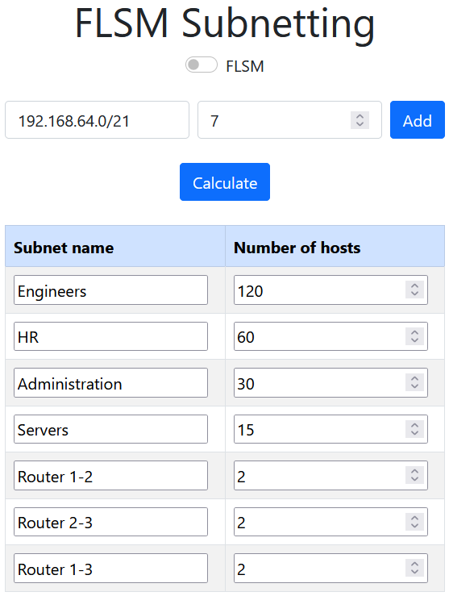
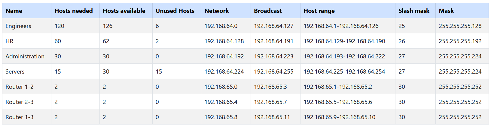
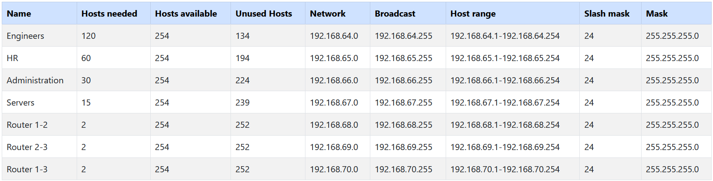
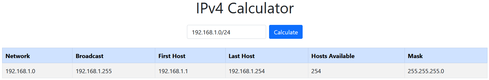

# Auto subnetter tool

I created this to tool to automatically create the subnetting for a given network with subnets and hosts per subnet.
The UI is very simple and easy to use to get results asap with error messages in case of wrong input.

It's usefull for networking courses where you have to compare the two subnetting methods: VLSM and FLSM and see which one has more unused IPs.

_The code is not optimized as I wanted to keep my comments and understand if I get back to it at some point._

# How to use the subnetting tool

# VLSM (Variable Length Subnet Mask)

# FLSM (Fixed Length Subnet Mask)

# IPv4 Calculator

# Improvements

If you want me to add some features or you have any suggestions, open an issue.
